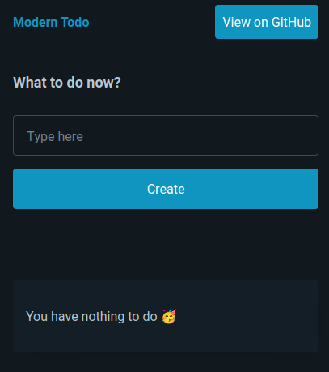
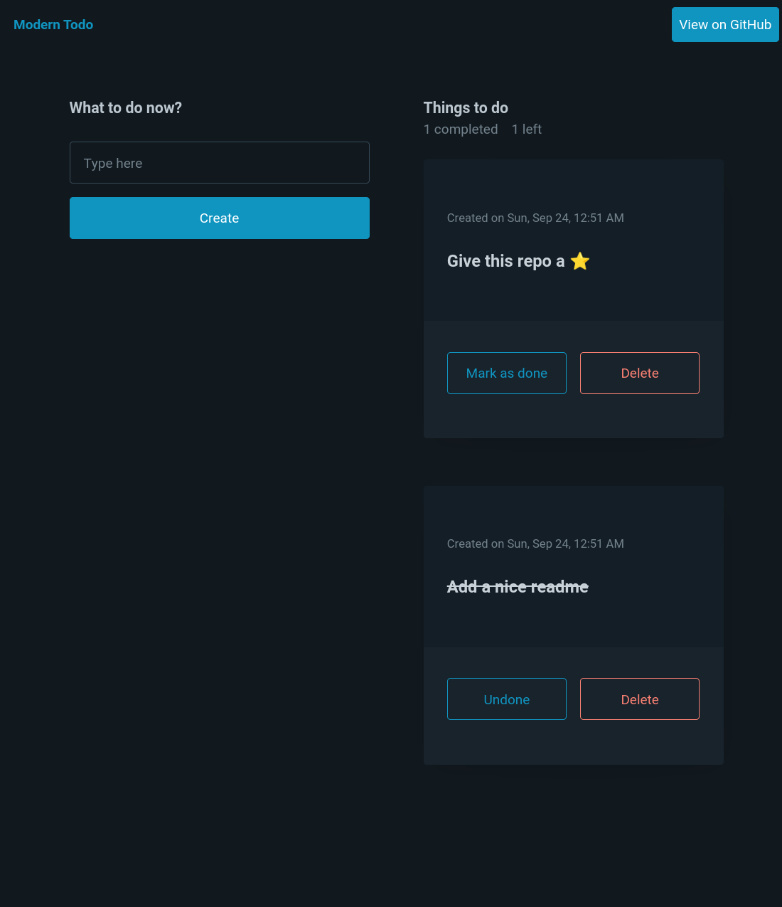
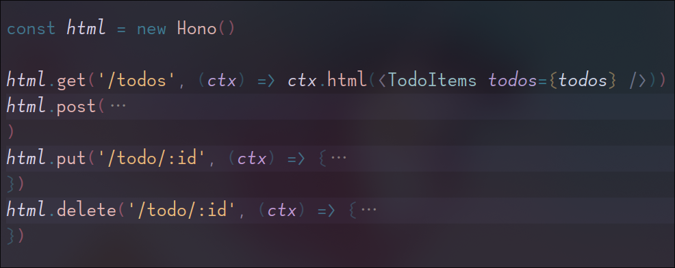
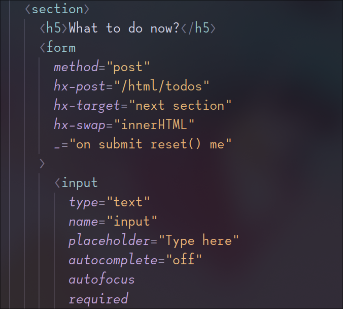

# BH2 Stack Todo List
A very simple todo list with CURD operations, made with Bun, Hono and HTMX.

### What is BH2 stack?
Well it is just a abbreviation I gave for Bun, Hono and HTMX. If there can be MEAN stack then why not BH2 stack.

### Screenshots








### Run on your device
**First install Bun**
> As of now (Sep 24, 2023) Bun is not available for Windows, you may use WSL instead.

```bash
curl -fsSL https://bun.sh/install | bash
```

**Clone my repo**
```bash
git clone 'github.com/Fallen-dev/BH2-stack-todo-list' && cd BH2-stack-todo-list
```

**Finally start the dev server**
```bash
bun start
```

**open the url on browser**
```
http://localhost:3000
```

### What are Bun, Hono and HTMX?

**Bun**
Bun is an all-in-one JS runtime as well as a package manager, bundler, test runner. You can replace Nodejs, npm with this.

[Visit Bun's official website](https://bun.sh/)

**Hono**
Hono is a web framework for building REST APIs blazingly fast and at ease. You can replace it with ExpressJS.
Hono is a Japanese word means flame 🔥.

[Visit website](https://hono.dev/)

> There is another web framework for creating APIs especially made for Bun called Elysia. It is the fastest of all the other web frameworks. I didn't use it because I like the naming conventions of Hono more than Elysia.

**HTMX**
It is HTML on steroids. AJAX, CSS transitions, web sockets everything just from the HTML. I have used HTMX for making requests to the server.
I have used `GET`, `POST`, `PUT` and `DELETE` requests.

[HTMX Website](https://htmx.org/)

> It is worth mentioning that I have also used [Hyprscript](https://hyperscript.org/) which is a language best paired with HTMX for adding extra interactions within just HTML. It is made by the same developer who made HTMX 👏.

## If you like it, give this repo a star
